# Lead Scoring RAG Pipeline

This project implements a Retrieval-Augmented Generation (RAG) pipeline to score financial leads. It leverages a language model to analyze synthetic financial documents and identify high-quality leads based on their content.

## Features

-   **Synthetic Data Generation**: Creates a large, diverse dataset of mock financial documents.
-   **Vector Store Creation**: Uses FAISS to create a searchable vector index of the documents.
-   **RAG Pipeline**: Retrieves relevant documents and uses a language model to answer questions.
-   **Lead Scoring**: Analyzes document content to score potential leads.

## Architecture

The project follows a modular architecture, with distinct components for each stage of the pipeline.

```mermaid
graph TD;
    A["📄 Document Generation <br/>(generate_documents.py)"] --> B{"📚 Mock Documents"};
    B --> C["pre-processing <br/>(preprocess.py)"];
    C --> D["Vector Store Creation <br/>(create_vector_store.py)"];
    D --> E{"FAISS Index"};
    E --> F["RAG Pipeline <br/>(rag_pipeline.py)"];
    G["User Query"] --> F;
    F --> H["Lead Scoring <br/>(lead_scoring.py)"];
    H --> I["Scored Leads"];
```



## 🛠️ Setup & Usage

### 1. Prerequisites

-   Python 3.8+
-   An NVIDIA GPU with CUDA installed is required for document generation.

### 2. Installation

Clone the repository and install the required dependencies:

```bash
pip install -r requirements.txt
```

### 3. Running the Pipeline

**Step 1: Generate Mock Documents**

This step uses `microsoft/phi-2` model to generate synthetic financial documents. It requires a GPU.

```bash
python src/generate_documents.py
```

**Step 2: Create the Vector Store**

This will preprocess the generated documents and create a FAISS index for efficient similarity search.

```bash
python src/create_vector_store.py
```

**Step 3: Run the Lead Scoring Application**

You can run the interactive lead scoring application:

```bash
python app.py
```

This will start a Streamlit interface where you can ask questions about the documents to find and score leads.

## ⚙️ Project Structure
- `app.py`: The main Streamlit application file.
- `requirements.txt`: A list of all the python dependencies.
- `faiss_index/`: This directory will store the FAISS index.
- `mock_docs/`: This directory will store the generated documents.
- `src/`: This directory contains all the source code for the project.
  - `generate_documents.py`: A script to generate a large number of detailed and varied synthetic financial documents.
  - `preprocess.py`: A script to preprocess the generated documents before creating the vector store.
  - `create_vector_store.py`: A script to create a FAISS vector store from the preprocessed documents.
  - `rag_pipeline.py`: A script that defines the RAG pipeline for retrieving relevant documents.
  - `lead_scoring.py`: A script to score leads based on the content of the documents.